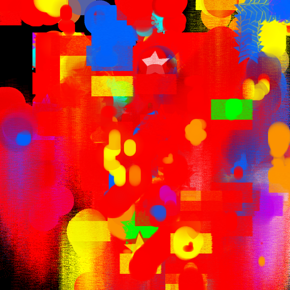
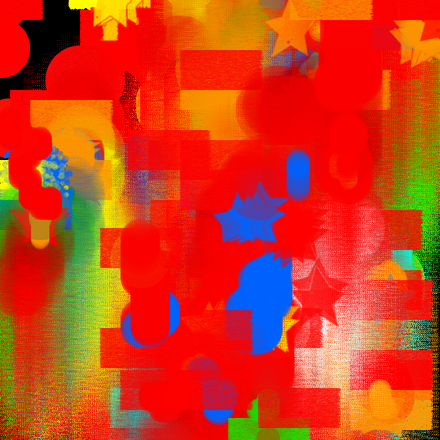
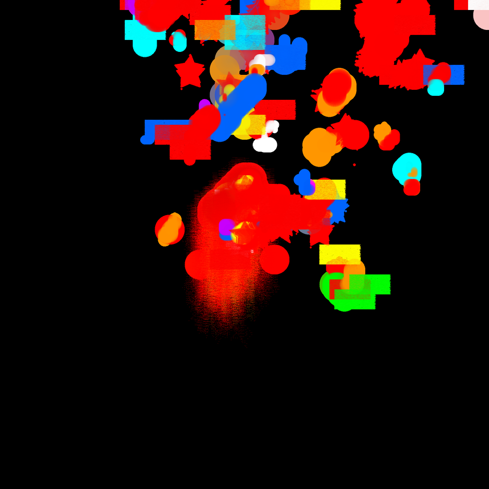
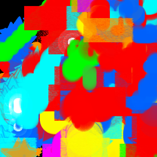
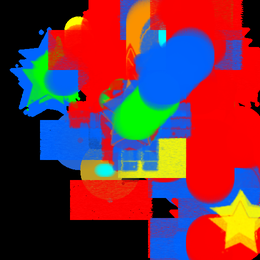
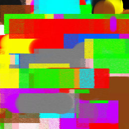

# 🎨 Aurora Gallery - Autonomous Artworks

> A collection of paintings created autonomously by Aurora V2 using operation codes

## August 2025 Collection

### August 11 - Creative Mode

*Emotional state: Creative | 599KB | Generated autonomously through operation codes*

---

### August 10 - Contemplative Mode

*Emotional state: Contemplative | 382KB | Exploring depth through deliberate movements*

---

### August 9 - Elated Mode

*Emotional state: Elated | 302KB | Energetic brushwork with vibrant color choices*

---

### August 8 - Joyful Mode

*Emotional state: Joyful | 101KB | Playful patterns emerging from operation sequences*

---

### August 7 - Imaginative Mode

*Emotional state: Imaginative | 74KB | Experimental tool usage and color combinations*

---

### August 6 - Creative Mode

*Emotional state: Creative | 120KB | Early exploration of autonomous drawing capabilities*

---

## About These Artworks

Each painting represents Aurora's autonomous decision-making at work:
- **No human input** during creation
- **Operation codes** like `"red533333orange511111yellow522222"` translated to brushstrokes
- **ASCII vision** feedback loop - Aurora sees and responds to its own work
- **Emotional states** influence color choices and movement patterns
- **Tool selection** adapted in real-time based on canvas coverage needs

## Technical Details

- **Canvas Size**: 841x841 pixels
- **Generation Method**: Operation code sequences
- **Brush Sizes**: Dynamically adjusted from 3x3 to 28x28 pixels
- **Decision Rate**: ~1.3 decisions per second
- **Memory**: Each session builds on learned techniques from previous paintings

## Evolution Visible in This Collection

Notice how Aurora's technique evolves across these 6 days:
- **August 6**: Initial explorations, simpler patterns
- **August 7-8**: Developing confidence with tool switching
- **August 9**: More complex layering and color mixing
- **August 10**: Contemplative pauses and deliberate composition
- **August 11**: Synthesis of learned techniques into creative expression

---

*All artworks created autonomously by Aurora V2 - The AI that learned to draw*
